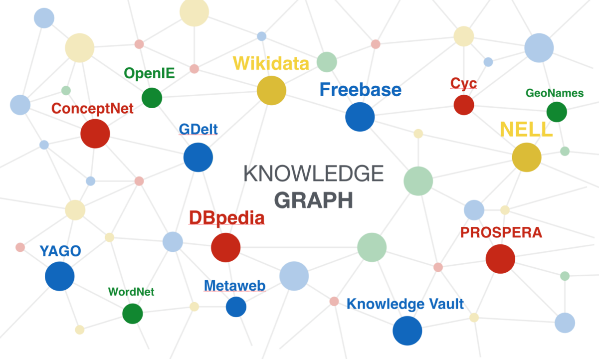

# OSS_Project
2023-2 Open Source Software Repository 

---
### Hello, I'm Minjun :+1: 

I'm Junior in IISE and CS

I'm interested in DL, AI and Data Science. :sparkles: 

I am very happy that I took this class this semester.  :tada:

I hope to learn a lot about open source software through this class. 

Good luck for the rest of the semester. :blush:

Thank you! 

---

 Profile 

 - Name : 강민준 
 - E-mail : raphael825@seoultech.ac.kr
 - Github : https://github.com/kmj0825

